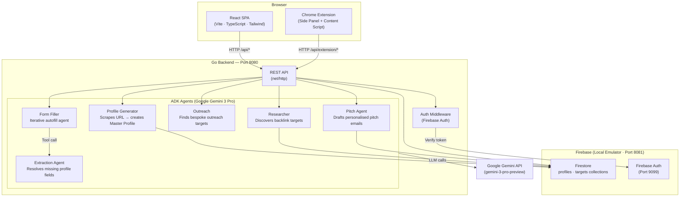

# System Architecture — AI SEO Backlink Engine

## Component Diagram



---

## Request Flow Examples

### 1. Profile Generation

```
User enters URL in UI
  → POST /api/profile/generate
  → Auth middleware validates Firebase token
  → Profile Generator agent scrapes the URL (web tool)
  → Gemini generates structured profile JSON
  → Profile saved to Firestore (profiles collection)
  → Response streamed back to UI
```

### 2. Kanban Target Discovery

```
User clicks "Find Targets"
  → POST /api/research/start
  → Researcher agent queries Gemini with profile context
  → Agent searches the web for niche directories
  → Discovered targets written to Firestore (targets collection)
  → React UI receives real-time Firestore snapshot updates
  → Targets appear as cards in the "Shortlist" column
```

### 3. Pitch Drafting (Event-Driven)

```
User drags card into "Drafting" column
  → UI calls POST /api/pitch/draft
  → Pitch Agent scrapes the target website
  → Gemini drafts personalised pitch using Master Profile
  → Draft saved to target document in Firestore
  → UI displays pitch in a modal for review
```

### 4. Chrome Extension Autofill Loop

```
User clicks "Autofill Target Form" in side panel
  LOOP (max 15 iterations):
    Content script scrapes DOM → serialises interactive elements
    → POST /api/extension/autofill (with page context)
    → Form Filler agent determines next action (TYPE / SELECT / CLICK / STOP)
        ↳ If field value unknown → calls Extraction Agent as a tool
           → Extraction Agent reads Firestore profile to resolve value
    → Action returned to extension
    → Content script executes action on the live page
  Until STOP action or max iterations reached
```

---

## Data Model (Firestore)

### `profiles` collection

| Field | Type | Description |
|---|---|---|
| `id` | string | Auto-generated document ID |
| `targetUrl` | string | The website URL that was profiled |
| `shortDescription` | string | One-line company blurb |
| `longDescription` | string | Full company description |
| `founderName` | string | Company founder name |
| `keywords` | []string | SEO-relevant keywords |
| `dynamicFields` | map | Custom key-value fields (e.g. postcode, support email) |

### `targets` collection

| Field | Type | Description |
|---|---|---|
| `id` | string | Auto-generated document ID |
| `domain` | string | Target domain (e.g. `coolblog.com`) |
| `url` | string | Full submission URL |
| `columnId` | string | Kanban column: `shortlist`, `in-progress`, `drafting`, `submitted`, `contacted`, `rejected` |
| `pitchDraft` | string | AI-generated pitch email (populated by Pitch Agent) |
| `notes` | string | Free-form user notes |
| `profileId` | string | Reference to the associated profile |

---

## ADK Agents

| Agent | File | Trigger | Description |
|---|---|---|---|
| `profile_generator` | `agent/profile_generator.go` | `POST /api/profile/generate` | Scrapes a URL and produces a structured Master Profile |
| `researcher` | `agent/researcher.go` | `POST /api/research/start` | Searches the web to discover niche backlink directories |
| `outreach` | `agent/outreach.go` | `POST /api/research/outreach` | Identifies personalised outreach targets |
| `pitch` | `agent/pitch.go` | `POST /api/pitch/draft` | Drafts personalised pitch emails for specific targets |
| `form_filler` | `agent/form_filler.go` | `POST /api/extension/autofill` | Determines next form fill action from page DOM state |
| `extraction` | `agent/extraction.go` | Called as tool by `form_filler` | Resolves missing profile data fields on demand |

All agents use **Google Gemini 3 Pro** (`gemini-3-pro-preview`) via the Google ADK Go SDK. Prompts are defined in the `prompts/` directory.

---

## Ports Reference

| Service | Port |
|---|---|
| Vite Dev Server (UI) | 5173 |
| Go Backend (API) | 8080 |
| Firestore Emulator | 8081 |
| Emulator UI | 4002 |
| Firebase Auth Emulator | 9099 |
